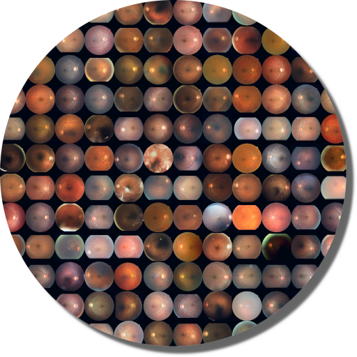

    

# A Toolkit for Lesions Segmentation in Fundus

This library offers a set of models (with pretrained weights) for the segmentation of lesions in fundus images.
As of now, four lesions are segmented

    1. Cotton Wool Spot
    2. Exudates
    3. Microaneurysms
    4. Hemmorrhages
    